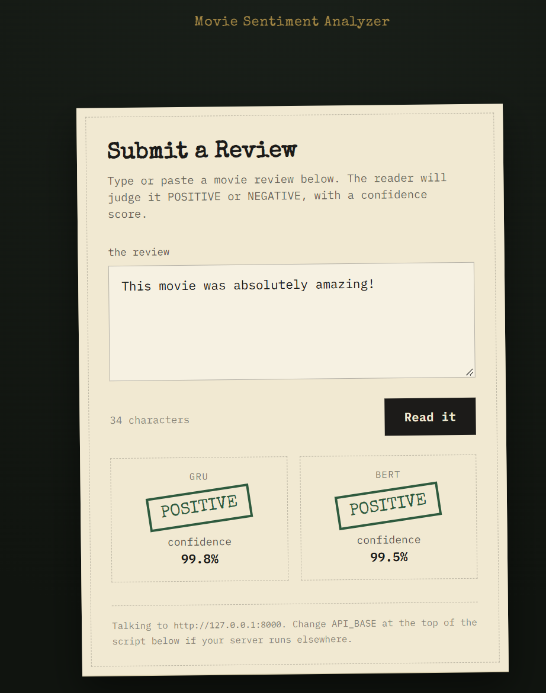
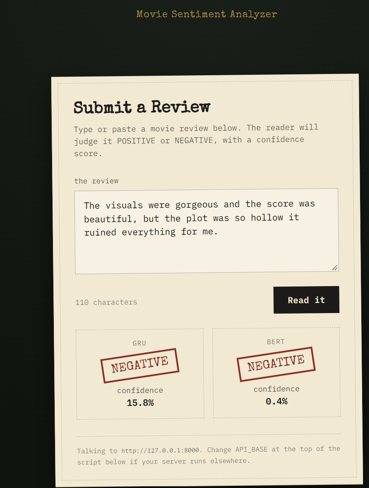
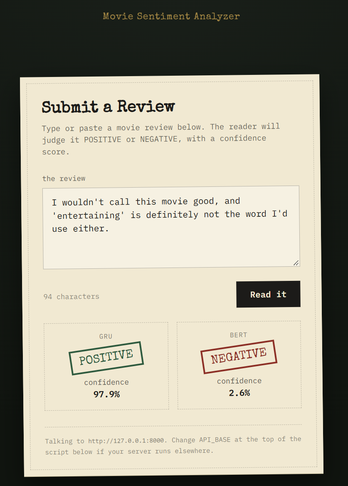
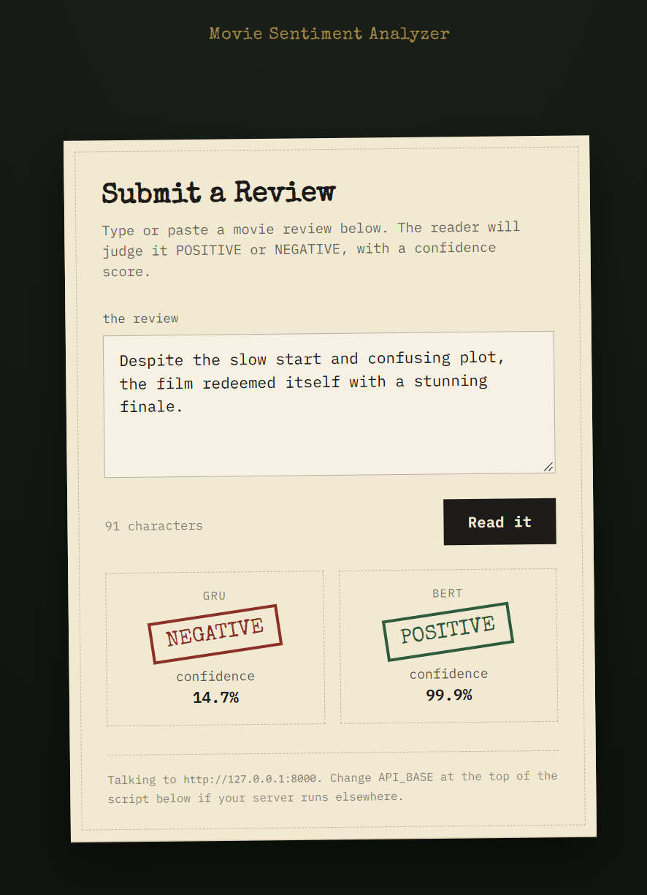

<div align="center">

# 🎬 Sentiment Analysis with FastAPI — GRU + BERT

**A REST API serving two sentiment classifiers side by side — a GRU and a fine-tuned BERT — both trained on the IMDB movie review dataset.**

Send it a review, get back both verdicts.

[](https://www.python.org/)
[](https://fastapi.tiangolo.com/)
[](https://pytorch.org/)
[](https://huggingface.co/docs/transformers)
[](#)

</div>

---

## 📖 Table of Contents

- [Overview](#-overview)
- [Models](#-models)
- [API Endpoints](#-api-endpoints)
- [Swagger UI](#-swagger-ui-docs)
- [Running Locally](#-running-locally)
- [Project Structure](#-project-structure)

---

## 🧭 Overview

This project wraps **two** trained sentiment classifiers — a lightweight **GRU (Gated Recurrent Unit)** and a fine-tuned **DistilBERT** — behind a single FastAPI service. Post one movie review, and the API runs it through both models and returns both verdicts, so you can compare a classic sequential model against a modern transformer on the exact same input.

It's a good way to see where the two approaches agree — and where a transformer's attention over the whole sentence beats a recurrent model's left-to-right reading, especially on negation, sarcasm, and reviews that change their mind halfway through.

---

## 🧠 Models

<table>
<tr>
<th align="center">🔁 GRU</th>
<th align="center">🤖 BERT</th>
</tr>
<tr>
<td valign="top">

**Architecture:** GRU recurrent neural network, built in PyTorch (`model.py`)

**Output:** Single logit → `sigmoid` → probability of positive

**Reads:** Sequentially, word by word

</td>
<td valign="top">

**Architecture:** Fine-tuned `distilbert-base-uncased` + linear classification head (`model.py`)

**Output:** 2 logits → `softmax` → probability of positive

**Reads:** The whole sequence at once via self-attention

</td>
</tr>
</table>

Both models are trained on the same **IMDB movie review dataset** for the same task — binary sentiment classification — and both return the same shape of result:

- 🏷️ **`label`** — `"POSITIVE"` if probability ≥ 0.5, otherwise `"NEGATIVE"`
- 📊 **`probability`** — the model's confidence in the positive class

### How inference works

At startup, the API loads artifacts for **both** models from the `artifacts/` folder:

| File | Used by | Purpose |
|---|---|---|
| `config.json` | GRU | Hyperparameters (vocab size, embedding dim, hidden size, layers, max length) |
| `word2idx.json` | GRU | Vocabulary mapping used to tokenize input text |
| `gru_model.pt` | GRU | Trained PyTorch model weights |
| `bert_config.json` | BERT | Checkpoint name, number of classes, dropout, max sequence length |
| `tokenizer/` | BERT | Saved Hugging Face tokenizer (vocab + config) |
| `bert_model.pt` | BERT | Fine-tuned DistilBERT weights |

Each model has its own preprocessing pipeline, run in parallel on every request:

```
                    ┌─→  clean text → word2idx tokenize → pad/truncate → GRU  ──→ sigmoid  ──┐
raw review text  ───┤                                                                        ├──→ combined JSON response
                    └─→  HF tokenizer (WordPiece) → attention mask → BERT ──→ softmax ──┘
```

1. **GRU path** — strip HTML tags, lowercase, remove non-letter characters, map words to IDs from the saved vocabulary, pad/truncate, run through the GRU, apply sigmoid
2. **BERT path** — tokenize with the saved Hugging Face tokenizer (WordPiece, with attention mask), run through DistilBERT, apply softmax over the 2 output classes

---

## 🔌 API Endpoints

| Method | Endpoint | Description |
|---|---|---|
| `GET` | `/` | Basic API metadata (name and description) |
| `GET` | `/health` | Health check — returns `{"status": "ok"}` |
| `POST` | `/predict` | Accepts `{"text": "..."}` and returns predictions from **both** models |

<details>
<summary><strong>▶ Example request</strong></summary>

```bash
curl -X POST "http://127.0.0.1:8000/predict" \
  -H "Content-Type: application/json" \
  -d '{"text": "This movie was absolutely amazing!"}'
```

</details>

<details>
<summary><strong>▶ Example response</strong></summary>

```json
{
  "gru": {
    "label": "POSITIVE",
    "probability": 0.9979891777038574
  },
  "bert": {
    "label": "POSITIVE",
    "probability": 0.9992310404777527
  }
}
```

</details>

---

## 🖥️ Swagger UI (`/docs`)

FastAPI auto-generates interactive API docs at `/docs`, where you can try out `/predict` directly from the browser and see both models' verdicts in one response.

<div align="center">

**✅ Easy Positive prediction**



**❌ Easy Negative prediction**



**🧩 Hard example predictions — GRU vs BERT**




</div>

---

## 🚀 Running Locally

**1. Clone the repository**
```bash
git clone https://github.com/rotoncsedu/Sentiment-Analysis-with-FastAPI.git
cd Sentiment-Analysis-with-FastAPI/sentiment-api
```

**2. Create and activate a virtual environment** *(optional but recommended)*
```bash
python -m venv venv

# Windows
venv\Scripts\activate

# macOS / Linux
source venv/bin/activate
```

**3. Install dependencies**
```bash
pip install -r requirements.txt
```

> ⚠️ First run needs internet access once — the BERT backbone architecture (`distilbert-base-uncased`) is fetched from Hugging Face before the fine-tuned weights are loaded on top of it.

**4. Run the API**
```bash
python -m uvicorn main:app --reload
```

The server starts at `http://127.0.0.1:8000`.

**5. Try it out**

| Where | Link |
|---|---|
| 📘 Interactive docs | [http://127.0.0.1:8000/docs](http://127.0.0.1:8000/docs) |
| ❤️ Health check | [http://127.0.0.1:8000/health](http://127.0.0.1:8000/health) |
| 🖼️ Standalone UI | Open `index.html` in a browser — shows both verdicts side by side |

---

## 📁 Project Structure

```
sentiment-api/
├── main.py                # FastAPI app — runs both models, returns combined result
├── predictor.py            # GRUPredictor + BERTPredictor classes
├── model.py                # GRUModel and BERTClassifier architectures
├── index.html               # Standalone UI comparing both models
├── test_api.py
├── requirements.txt
└── artifacts/
    ├── config.json          # GRU hyperparameters
    ├── word2idx.json         # GRU vocabulary
    ├── gru_model.pt           # GRU weights
    ├── bert_config.json       # BERT checkpoint/config
    ├── bert_model.pt          # Fine-tuned BERT weights
    └── tokenizer/              # Saved HF tokenizer files
```

<div align="center">

---

Made with 🔁 GRU, 🤖 BERT, 🧠 PyTorch, and ⚡ FastAPI

</div>